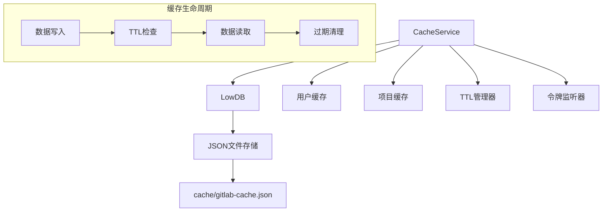
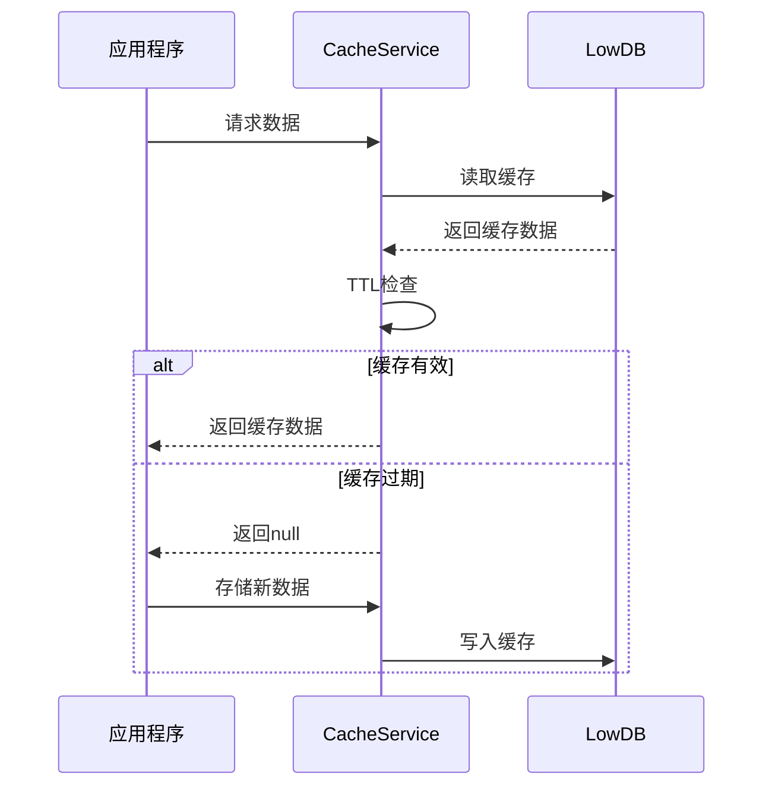

# 数据缓存服务模块

> **文件路径**: `src/services/CacheService.ts`  
> **模块类型**: 基础设施服务层  
> **依赖关系**: LowDB, Node.js文件系统

## 📋 模块概述

**CacheService** 是项目的持久化缓存服务，基于LowDB提供高效的本地JSON数据存储。主要用于缓存GitLab API响应数据，显著减少网络请求，提升应用响应速度。

### 核心职责
- 💾 **数据持久化**: 基于LowDB的JSON文件存储
- ⏱️ **TTL管理**: 24小时缓存生命周期管理
- 🔄 **自动清理**: 过期数据自动清理机制
- 🔐 **令牌感知**: Access Token变更时自动清空缓存
- 📊 **统计监控**: 缓存使用情况统计

## 🏗️ 技术架构

### 设计模式
- **单例模式**: 全局`cacheService`实例
- **策略模式**: 用户/项目不同缓存策略
- **观察者模式**: 令牌变更监听

### 数据结构设计
```typescript
interface CacheData {
  users: Record<string, { data: any; timestamp: number }>;
  projects: Record<string, { data: any; timestamp: number }>;
  accessToken?: string; // 当前令牌追踪
}
```

### 架构图


## 🔧 核心功能

### 1. 数据库初始化与配置
```typescript
constructor(cachePath?: string, cacheDurationHours: number = 24) {
  const defaultPath = join(process.cwd(), 'cache', 'gitlab-cache.json');
  const dbPath = cachePath || process.env.GITLAB_CACHE_PATH || defaultPath;
  
  // 自动创建目录和文件
  if (!existsSync(cacheDir)) {
    mkdirSync(cacheDir);
  }
  
  // LowDB适配器初始化
  const adapter = new JSONFile<CacheData>(dbPath);
  this.db = new Low(adapter, { users: {}, projects: {} });
}
```

**特性**:
- 自动目录创建
- 默认24小时TTL
- 环境变量配置支持
- 优雅的初始化失败处理

### 2. TTL(生存时间)管理
```typescript
private isValidCache(timestamp: number): boolean {
  return Date.now() - timestamp < this.cacheDuration;
}
```

**TTL策略**:
- 默认24小时过期
- 可配置缓存持续时间
- 毫秒级时间戳精度

### 3. 用户数据缓存
```typescript
async getUser(userId: string): Promise<any | null> {
  const userCache = this.db.data?.users[userId];
  
  if (userCache && this.isValidCache(userCache.timestamp)) {
    logger.info(`Cache hit for user: ${userId}`);
    return userCache.data;
  }
  return null;
}

async setUser(userId: string, data: any): Promise<void> {
  this.db.data.users[userId] = {
    data,
    timestamp: Date.now(),
  };
  await this.db.write();
}
```

### 4. 项目数据缓存
```typescript
async getProject(projectId: string): Promise<any | null> {
  const projectCache = this.db.data?.projects[projectId];
  
  if (projectCache && this.isValidCache(projectCache.timestamp)) {
    logger.info(`Cache hit for project: ${projectId}`);
    return projectCache.data;
  }
  return null;
}
```

## 🔐 安全性与令牌管理

### Access Token变更检测
```typescript
private async checkAndClearCacheOnTokenChange(): Promise<void> {
  if (this.db.data?.accessToken && this.db.data.accessToken !== this.currentAccessToken) {
    logger.info('Access token changed, clearing all cache');
    this.db.data = { users: {}, projects: {}, accessToken: this.currentAccessToken };
    await this.db.write();
  }
}
```

**安全特性**:
- 令牌变更自动检测
- 过期缓存自动清空
- 防止跨用户数据泄露
- 详细的安全日志

## ⚡ 性能优化

### 1. 智能缓存策略
| 数据类型 | 缓存时长 | 更新策略 | 使用场景 |
|----------|----------|----------|----------|
| 用户信息 | 24小时 | 懒加载更新 | 用户基本信息 |
| 项目信息 | 24小时 | 主动缓存 | 项目元数据 |

### 2. 批量清理优化
```typescript
async clearExpiredCache(): Promise<void> {
  let hasChanges = false;
  
  // 批量检查过期项
  for (const [userId, userCache] of Object.entries(this.db.data.users)) {
    if (!this.isValidCache(userCache.timestamp)) {
      delete this.db.data.users[userId];
      hasChanges = true;
    }
  }
  
  // 仅在有变更时写入
  if (hasChanges) {
    await this.db.write();
  }
}
```

**优化特性**:
- 批量过期检查
- 延迟写入减少I/O
- 内存效率优化

## 📊 监控与统计

### 缓存使用统计
```typescript
async getCacheStats(): Promise<{ userCount: number; projectCount: number }> {
  return {
    userCount: Object.keys(this.db.data.users).length,
    projectCount: Object.keys(this.db.data.projects).length,
  };
}
```

### 关键指标监控
- **缓存命中率**: 日志记录每次命中/未命中
- **存储使用量**: 用户/项目缓存条目数
- **数据新鲜度**: TTL有效性统计
- **I/O性能**: 读写操作耗时

## 🔄 生命周期管理

### 缓存维护流程


## 🛡️ 错误处理与容错

### 异常场景处理
1. **文件系统异常**: 目录创建失败时的优雅降级
2. **JSON解析错误**: 损坏数据文件的重置策略
3. **写入权限**: 权限不足时的警告日志
4. **磁盘空间**: 存储空间不足的处理

### 容错机制
```typescript
try {
  await this.db.read();
} catch (error) {
  logger.warn(`Cache database initialization warning: ${String(error)}`);
  // 创建默认数据结构
  this.db.data = { users: {}, projects: {}, accessToken: this.currentAccessToken };
}
```

## 🔍 使用示例

```typescript
// 1. 获取项目缓存
const project = await cacheService.getProject('123');
if (!project) {
  // 缓存未命中，从API获取
  const freshProject = await gitLabService.getProject(123);
  await cacheService.setProject('123', freshProject);
}

// 2. 缓存统计
const stats = await cacheService.getCacheStats();
console.log(`缓存统计: 用户${stats.userCount}, 项目${stats.projectCount}`);

// 3. 清理过期缓存
await cacheService.clearExpiredCache();
```

## 📁 文件结构

### 缓存文件位置
- **默认路径**: `./cache/gitlab-cache.json`
- **环境变量**: `GITLAB_CACHE_PATH`
- **文件格式**: JSON (人类可读)

### 示例文件结构
```json
{
  "users": {
    "123": {
      "data": { "id": 123, "name": "张三" },
      "timestamp": 1705467600000
    }
  },
  "projects": {
    "456": {
      "data": { "id": 456, "name": "awesome-project" },
      "timestamp": 1705467600000
    }
  },
  "accessToken": "glpat-xxx"
}
```

---

*📅 最后更新: 2025年1月17日 | 💾 缓存策略: 24小时TTL*

