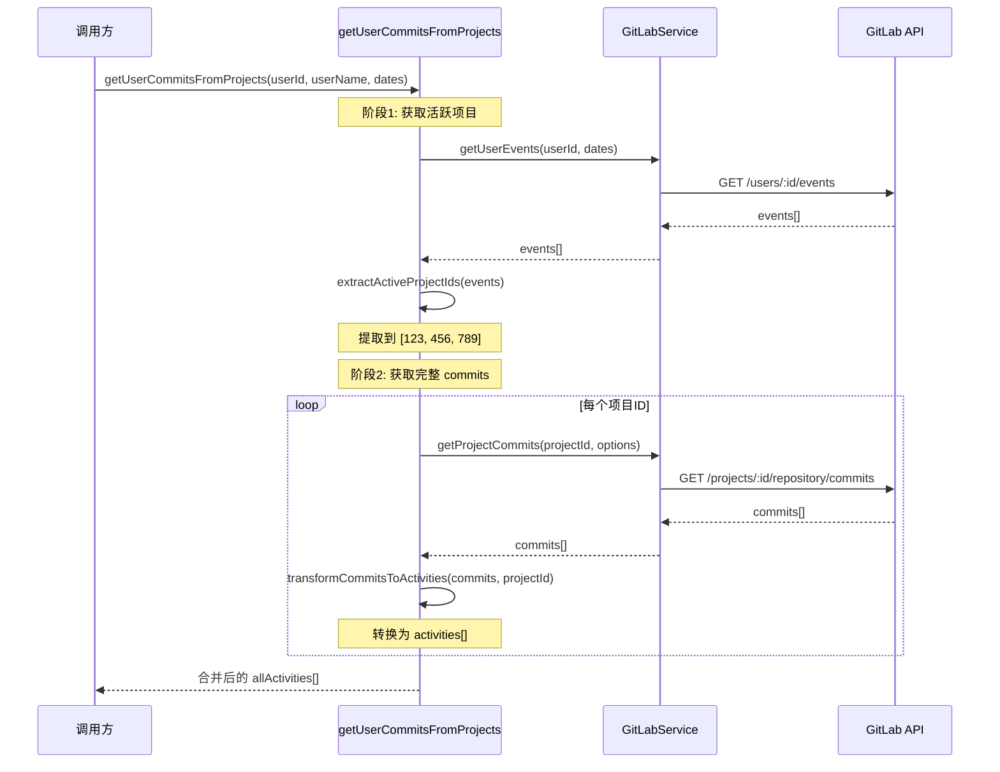
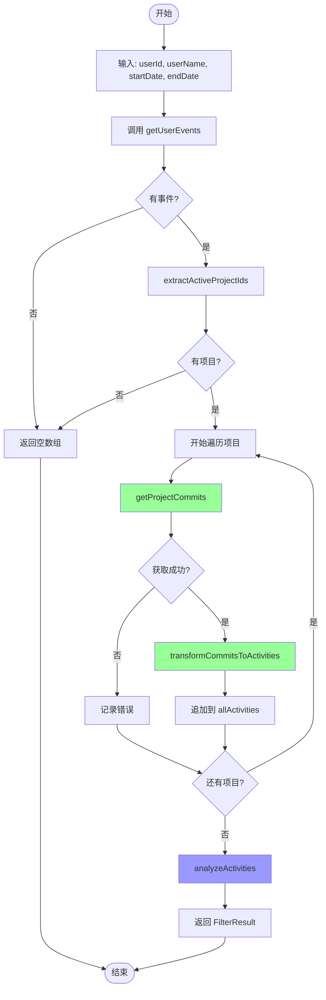

# 活动事件分析器模块 (重构版)

> **文件路径**: `src/utils/EventAnalyst.ts`  
> **模块类型**: 核心业务逻辑层  
> **最后更新**: 2025年12月3日

## 📋 模块概述

**EventAnalyst** 是项目的核心数据处理模块，负责从 GitLab 获取完整的 commit 数据并进行智能分析和分类。该模块在 2025-12-03 进行了重大重构，采用两阶段获取策略解决数据不完整的问题。

### 核心职责
- 🔍 **项目发现**: 从用户事件中提取活跃项目
- 📥 **数据获取**: 从每个项目获取完整的 commit 历史
- 🔄 **数据转换**: 将 GitLab Commits 转换为标准化的 Activity 对象
- 🧠 **智能分类**: 基于关键词的活动类型识别
- 📊 **统计分析**: 生成多维度统计数据

## 🏗️ 技术架构

### 重构前后对比

#### 旧架构（已废弃）
```mermaid
graph LR
    A[getUserEvents] --> B[GitLabEvent[]]
    B --> C[transformCommitEventToActivity]
    C --> D[GitLabActivity[]]
    
    style C fill:#ff9999
```

**问题**:
- ❌ 只依赖 `getUserEvents`，会漏掉部分 commits
- ❌ 事件流有数量限制（最多 500 条）
- ❌ 批量推送时只记录一个事件

#### 新架构（当前）
```mermaid
graph TB
    A[getUserEvents] --> B[GitLabEvent[]]
    B --> C[extractActiveProjectIds]
    C --> D[ProjectIds[]]
    
    D --> E[Loop: 每个项目]
    E --> F[getProjectCommits]
    F --> G[GitLabCommit[]]
    G --> H[transformCommitsToActivities]
    H --> I[GitLabActivity[]]
    
    I --> J[合并所有 Activities]
    J --> K[analyzeActivities]
    K --> L[FilterResult]
    
    style C fill:#99ff99
    style F fill:#99ff99
    style H fill:#99ff99
```

**优势**:
- ✅ 获取完整的 commit 历史
- ✅ 支持跨所有分支查询
- ✅ 按作者精确过滤
- ✅ 更好的容错处理

## 🔧 核心函数

### 1. extractActiveProjectIds()

从用户事件中提取活跃的项目ID列表。

```typescript
export const extractActiveProjectIds = (events: GitLabEvent[]): number[]
```

**功能**:
- 遍历所有用户事件
- 提取 `project_id` 字段
- 使用 `Set` 自动去重
- 返回唯一的项目ID数组

**示例**:
```typescript
const events = await gitLabService.getUserEvents(userId, startDate, endDate);
const projectIds = extractActiveProjectIds(events);
// 输出: [123, 456, 789]
```

**日志**:
```
[EventAnalyst] 从 50 个事件中提取到 5 个活跃项目
```

---

### 2. transformCommitsToActivities()

将 GitLab Commit 对象转换为标准化的 GitLabActivity 对象。

```typescript
export const transformCommitsToActivities = async (
  commits: GitLabCommit[],
  projectId: number
): Promise<GitLabActivity[]>
```

**参数**:
- `commits`: GitLab Commits API 返回的 commit 列表
- `projectId`: 项目ID，用于获取项目信息

**返回**: 标准化的 Activity 对象数组

**转换映射**:
| GitLabCommit 字段 | GitLabActivity 字段 | 说明 |
|------------------|-------------------|------|
| `id` (SHA) | `id` | Commit SHA 作为唯一标识 |
| `title` | `title` | Commit 标题 |
| `message` | `description` | 完整的 commit 消息 |
| `committed_date` | `createdAt` | 提交时间 |
| `author_name` | `author` | 作者名称 |
| `web_url` | `webUrl` | GitLab 链接 |
| - | `type` | 固定为 `'commit'` |
| - | `action` | 固定为 `'committed'` |
| - | `authorId` | 固定为 `0`（API 不返回） |

**过滤逻辑**:
```typescript
// 自动过滤掉 "Merge branch" 开头的合并提交
if (commit.title.startsWith('Merge branch')) {
  logger.debug(`[EventAnalyst] 过滤掉合并提交: ${commit.title}`);
  continue;
}
```

**示例**:
```typescript
const commits = await gitLabService.getProjectCommits(projectId, options);
const activities = await transformCommitsToActivities(commits, projectId);
```

**日志**:
```
[EventAnalyst] 项目 my-project 转换了 23 个 commits
```

---

### 3. getUserCommitsFromProjects() ⭐

核心方法，实现两阶段获取策略，获取用户在指定时间范围内的完整 commits。

```typescript
export const getUserCommitsFromProjects = async (
  userId: string | number,
  userName: string,
  startDate: string,
  endDate: string
): Promise<GitLabActivity[]>
```

**参数**:
- `userId`: 用户ID（用于获取事件）
- `userName`: 用户名（用于过滤 commits）
- `startDate`: 开始日期，格式 `YYYY-MM-DD`
- `endDate`: 结束日期，格式 `YYYY-MM-DD`

**返回**: 完整的 Activity 对象数组

**执行流程**:



**关键特性**:

1. **时间格式转换**:
```typescript
const sinceISO = `${startDate}T00:00:00Z`;  // 2025-01-01 → 2025-01-01T00:00:00Z
const untilISO = `${endDate}T23:59:59Z`;    // 2025-01-31 → 2025-01-31T23:59:59Z
```

2. **完整查询选项**:
```typescript
const commits = await gitLabService.getProjectCommits(projectId, {
  author: userName,  // 按作者过滤
  since: sinceISO,   // ISO 8601 开始时间
  until: untilISO,   // ISO 8601 结束时间
  all: true,         // 获取所有分支
  perPage: 100,      // 每页 100 条
});
```

3. **容错处理**:
```typescript
try {
  // 获取项目 commits
} catch (error) {
  logger.error(`获取项目 ${projectId} 的 commits 失败: ${error}`);
  // 继续处理下一个项目，不中断整体流程
}
```

**日志输出**:
```
[EventAnalyst] 开始获取用户 John Doe 的完整 commits (2025-01-01 至 2025-01-31)
[EventAnalyst] 从 50 个事件中提取到 5 个活跃项目
[EventAnalyst] 获取项目 123 的 commits...
[GitLabService] 成功获取项目 123 的 23 个 commits
[EventAnalyst] 项目 my-project 转换了 23 个 commits
[EventAnalyst] 获取项目 456 的 commits...
[GitLabService] 成功获取项目 456 的 15 个 commits
[EventAnalyst] 项目 another-project 转换了 15 个 commits
[EventAnalyst] 共获取到 38 个 commits
```

---

### 4. analyzeActivities()

对活动进行智能分类和统计分析（该函数保持不变）。

```typescript
export const analyzeActivities = async (
  activities: GitLabActivity[]
): Promise<FilterResult>
```

**功能**:
- 基于关键词匹配进行活动分类
- 生成多维度统计数据
- 记录分类原因

**分类类型**:
- `bug_fix`: Bug修复
- `feature`: 新功能
- `improvement`: 改进优化
- `documentation`: 文档更新
- `test`: 测试
- `config`: 配置更改
- `other`: 其他

**返回结构**:
```typescript
interface FilterResult {
  activities: GitLabActivity[];           // 分类后的活动列表
  matchReasons: Map<string, string[]>;    // 活动ID → 匹配原因
  statistics: {
    total: number;                        // 总数
    byType: Record<ActivityType, number>; // 按类型统计
    byProject: Record<string, number>;    // 按项目统计
  };
}
```

## 📊 完整数据流

### 端到端流程图



## 🔍 使用示例

### 基本用法

```typescript
import { getUserCommitsFromProjects, analyzeActivities } from './utils/EventAnalyst.js';
import { gitLabService } from './services/GitLabService.js';

// 1. 获取当前用户
const user = await gitLabService.getCurrentUser();

// 2. 获取完整的 commits
const activities = await getUserCommitsFromProjects(
  user.id,
  user.name,
  '2025-01-01',
  '2025-01-31'
);

console.log(`获取到 ${activities.length} 个 commits`);

// 3. 分析和分类
const result = await analyzeActivities(activities);

console.log(`总计: ${result.statistics.total}`);
console.log(`Bug修复: ${result.statistics.byType.bug_fix}`);
console.log(`新功能: ${result.statistics.byType.feature}`);
```

### 在 MCP Tool 中使用

```typescript
// src/tools/GitLabActivityTool.ts

async execute(input: GitLabActivitySchema) {
  const { startDate, endDate } = input;
  
  // 获取当前用户
  const currentUser = await gitlabService.getCurrentUser();
  
  // 使用新方法获取完整的 commits
  const activities = await getUserCommitsFromProjects(
    currentUser.id,
    currentUser.name,
    startDate,
    endDate
  );
  
  // 分析并生成报告
  const result = await analyzeActivities(activities);
  return formatActivitiesMarkdown(result, { start, end });
}
```

## ⚡ 性能考虑

### 当前实现

- **串行处理**: 逐个项目获取 commits
- **单页查询**: 每个项目最多获取 100 个 commits
- **项目缓存**: 使用 CacheService 缓存项目信息

### 性能指标

| 指标 | 当前值 | 说明 |
|-----|-------|------|
| 单项目查询时间 | ~500ms | 取决于 commits 数量 |
| 5个项目总时间 | ~2.5s | 串行处理 |
| API 调用数 | N+1 | N个项目 + 1次事件查询 |
| 缓存命中率 | >90% | 项目信息缓存 |

### 优化建议

1. **并发查询**:
```typescript
// 当前: 串行
for (const projectId of projectIds) {
  const commits = await getProjectCommits(projectId);
}

// 优化: 并发
const commitsPromises = projectIds.map(id => getProjectCommits(id));
const allCommits = await Promise.all(commitsPromises);
```

2. **分页支持**:
```typescript
// 处理超过 100 个 commits 的场景
async function getAllCommits(projectId, options) {
  let page = 1;
  let allCommits = [];
  
  while (true) {
    const commits = await getProjectCommits(projectId, { ...options, page });
    if (commits.length === 0) break;
    allCommits.push(...commits);
    page++;
  }
  
  return allCommits;
}
```

3. **增量更新**:
```typescript
// 只获取最新的 commits
const lastFetchTime = await cache.getLastFetchTime(projectId);
const commits = await getProjectCommits(projectId, {
  since: lastFetchTime
});
```

## 🛡️ 错误处理

### 错误类型

1. **网络错误**:
```typescript
// GitLabService 中处理
catch (error) {
  if (error.name === 'AbortError') {
    throw new Error('GitLab API 请求超时');
  }
}
```

2. **API 错误**:
```typescript
// 项目无仓库或权限不足
async getProjectCommits(projectId) {
  try {
    return await this.fetchGitLab(endpoint);
  } catch (error) {
    logger.error(`获取项目 ${projectId} 的 commits 失败`);
    return []; // 返回空数组，不中断流程
  }
}
```

3. **数据转换错误**:
```typescript
// 单个项目失败不影响其他项目
for (const projectId of projectIds) {
  try {
    const commits = await getProjectCommits(projectId);
    const activities = await transformCommitsToActivities(commits, projectId);
    allActivities.push(...activities);
  } catch (error) {
    logger.error(`处理项目 ${projectId} 失败: ${error}`);
    // 继续处理下一个项目
  }
}
```

## 🔄 重构历史

### 2025-12-03: 两阶段获取策略

**变更内容**:
- ✅ 新增 `extractActiveProjectIds()` 函数
- ✅ 新增 `transformCommitsToActivities()` 函数
- ✅ 新增 `getUserCommitsFromProjects()` 核心方法
- ✅ 移除 `transformCommitEventToActivity()` 旧方法
- ✅ 集成 GitLab Commits API

**迁移指南**:

旧代码：
```typescript
const events = await gitLabService.getUserEvents(userId, startDate, endDate);
const activities = await transformCommitEventToActivity(events);
```

新代码：
```typescript
const activities = await getUserCommitsFromProjects(userId, userName, startDate, endDate);
```

**破坏性变更**:
- `transformCommitEventToActivity()` 已完全移除
- 需要传入 `userName` 参数用于过滤 commits

详见：[REFACTORING_COMMITS_API.md](../../REFACTORING_COMMITS_API.md)

---

*📅 最后更新: 2025年12月3日 | 🔄 状态: 生产就绪*

