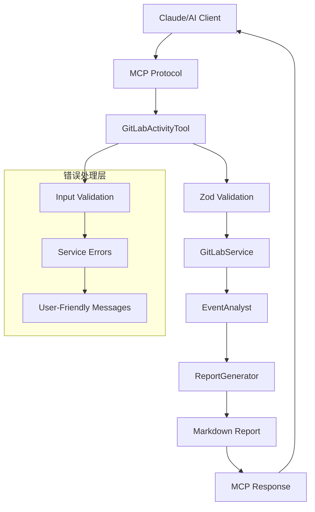
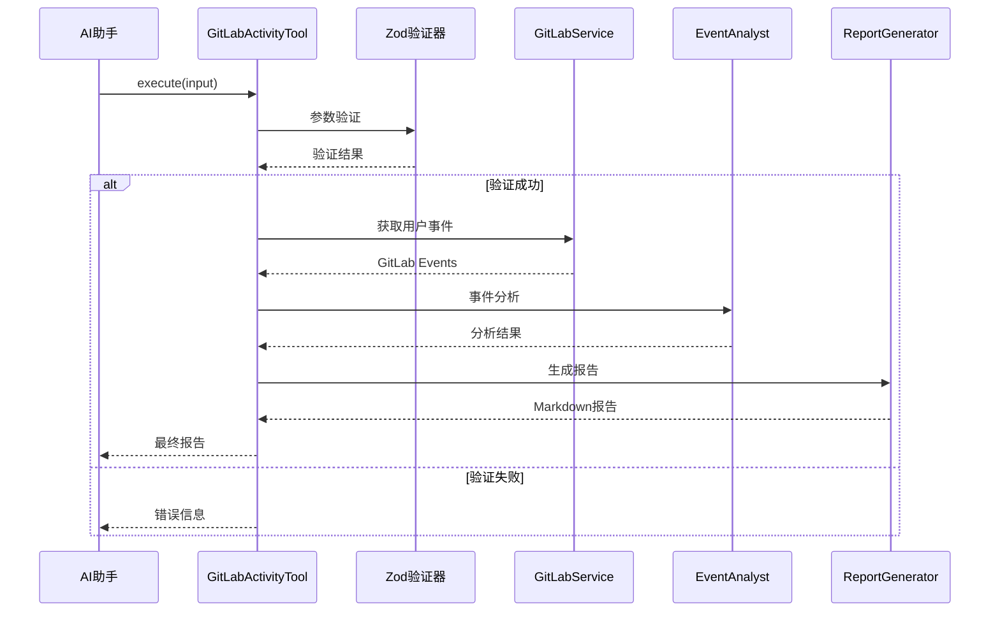
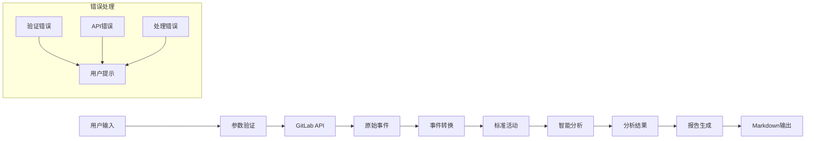

# MCP工具入口模块

> **文件路径**: `src/tools/GitLabActivityTool.ts`  
> **模块类型**: MCP工具层/API入口  
> **依赖关系**: mcp-framework, Zod, GitLabService, EventAnalyst, ReportGenerator

## 📋 模块概述

**GitLabActivityTool** 是项目的MCP工具入口，作为Claude等AI助手与GitLab活动分析功能的桥梁。该模块实现了完整的MCP Tool规范，提供了类型安全的API接口和用户友好的错误处理。

### 核心职责
- 🔌 **MCP协议实现**: 标准MCP Tool接口
- ✅ **参数验证**: 基于Zod的严格类型检查
- 🎛️ **业务协调**: 协调各个服务模块完成任务
- 📄 **结果格式化**: 将分析结果转换为用户可读格式
- 🛡️ **错误处理**: 优雅的异常处理和用户反馈

## 🏗️ 技术架构

### MCP工具架构图


### 执行流程


## 🔧 核心功能

### 1. MCP工具定义
```typescript
class GitLabActivityTool extends MCPTool<GitLabActivitySchema> {
  name = 'gitlab_activity_report';
  description = '获取当前用户的 GitLab 活动记录并生成 Markdown 报告';
  
  schema = {
    startDate: {
      type: z.string().regex(/^\d{4}-\d{2}-\d{2}$/, '日期格式必须为 YYYY-MM-DD'),
      description: '开始日期 (ISO 8601 格式)',
      required: true,
    },
    endDate: {
      type: z.string().regex(/^\d{4}-\d{2}-\d{2}$/, '日期格式必须为 YYYY-MM-DD'),
      description: '结束日期 (ISO 8601 格式)',
      required: false,
    },
  };
}
```

**工具特性**:
- **清晰的名称**: 语义化工具名称
- **详细描述**: 用户友好的功能说明
- **严格验证**: 正则表达式日期格式验证
- **可选参数**: 灵活的参数配置

### 2. 参数验证架构
```typescript
interface GitLabActivitySchema {
  startDate: string;  // YYYY-MM-DD格式
  endDate: string;    // YYYY-MM-DD格式，可选
}

// Zod Schema定义
const dateRegex = /^\d{4}-\d{2}-\d{2}$/;
const currentYear = new Date().getFullYear();

schema = {
  startDate: {
    type: z.string().regex(dateRegex, `日期格式必须为 YYYY-MM-DD (例如: ${currentYear}-01-01)`),
    description: `开始日期 (ISO 8601 格式，例如: ${currentYear}-01-01)`,
    required: true,
  },
  endDate: {
    type: z.string().regex(dateRegex, `日期格式必须为 YYYY-MM-DD (例如: ${currentYear}-01-31)`),
    description: `结束日期 (ISO 8601 格式，例如: ${currentYear}-01-31)`,
    required: false,
  },
};
```

**验证特性**:
- **类型安全**: TypeScript接口约束
- **格式验证**: 正则表达式日期格式检查
- **动态示例**: 基于当前年份的示例值
- **详细错误**: 具体的格式错误提示

### 3. 主执行流程
```typescript
async execute(input: GitLabActivitySchema) {
  try {
    const { startDate, endDate } = input;
    logger.info(`[GitLabActivityTool] 执行工具 ${JSON.stringify(input)}`);

    // 1. 获取服务实例
    const gitlabService = new GitLabService();

    // 2. 获取当前用户信息
    const currentUser = await gitlabService.getCurrentUser();
    const targetUserId = currentUser.id;

    // 3. 获取用户事件
    const events = await gitlabService.getUserEvents(targetUserId, startDate, endDate);

    // 4. 空数据处理
    if (events.length === 0) {
      return this.formatEmptyResult(currentUser, startDate, endDate);
    }

    // 5. 分析活动数据
    const activities = await transformCommitEventToActivity(events);
    const analysisResult = await analyzeActivities(activities);

    // 6. 生成详细报告
    return formatActivitiesMarkdown(analysisResult, {
      start: new Date(startDate),
      end: new Date(endDate),
    });
  } catch (error) {
    logger.error(`[GitLabActivityTool] 执行工具失败: ${error}`);
    return `❌ 执行工具失败: ${error}`;
  }
}
```

## 📊 数据处理管道

### 处理步骤详解
1. **参数验证**: Zod schema自动验证输入参数
2. **用户认证**: 获取当前用户信息进行身份确认  
3. **数据获取**: 调用GitLab API获取指定时间范围的活动
4. **空值处理**: 优雅处理无数据情况
5. **数据转换**: 将原始事件转换为标准化活动记录
6. **智能分析**: 活动分类和统计分析
7. **报告生成**: 格式化为专业Markdown报告
8. **错误处理**: 捕获异常并提供用户友好的错误信息

### 数据流转图


## 🛡️ 错误处理机制

### 1. 空数据处理
```typescript
if (events.length === 0) {
  return `📭 在指定时间范围内未找到活动记录。

**查询参数：**
- 用户：${currentUser.username} (${targetUserId})
- 开始日期：${startDate || '未指定'}
- 结束日期：${endDate || '未指定'}

请检查：
1. 时间范围内是否有 GitLab 活动
2. 访问令牌是否有足够权限`;
}
```

**空数据特性**:
- 友好的emoji提示
- 详细的查询参数回显
- 具体的检查建议
- 格式化的输出结构

### 2. 异常处理策略
```typescript
catch (error) {
  logger.error(`[GitLabActivityTool] 执行工具失败: ${error}`);
  return `❌ 执行工具失败: ${error}`;
}
```

**异常处理特性**:
- 详细的错误日志记录
- 用户友好的错误消息
- 一致的错误格式
- 错误信息透明化

### 3. 常见错误场景
| 错误类型 | 触发条件 | 用户提示 | 解决方案 |
|----------|----------|----------|----------|
| **参数验证** | 日期格式错误 | 日期格式必须为 YYYY-MM-DD | 检查日期格式 |
| **认证失败** | Token无效 | GitLab配置错误 | 检查环境变量 |
| **权限不足** | 缺少权限 | 访问令牌权限不足 | 更新Token权限 |
| **网络异常** | 连接失败 | 网络错误：无法连接 | 检查网络连接 |
| **空数据** | 无活动记录 | 在指定时间范围内未找到活动 | 调整时间范围 |

## 📝 日志体系

### 关键日志节点
```typescript
// 1. 工具执行开始
logger.info(`[GitLabActivityTool] 执行工具 ${JSON.stringify(input)}`);

// 2. 用户信息获取
logger.info(`[gitlabService] 获取当前用户信息 ${targetUserId}`);

// 3. 事件数据获取
logger.info(`[gitlabService] 获取用户事件 ${events.length} 条`);

// 4. 错误处理
logger.error(`[GitLabActivityTool] 执行工具失败: ${error}`);
```

**日志特性**:
- 统一的日志前缀标识
- 结构化的参数记录
- 关键指标量化记录
- 详细的错误堆栈

### 调试信息
- **输入参数**: 完整的用户输入JSON序列化
- **执行状态**: 各个处理步骤的进度
- **数据量统计**: 获取的事件数量
- **性能指标**: 各阶段执行时间（可扩展）

## 🎯 用户体验设计

### 1. 友好的错误消息
```typescript
// 配置错误
"GitLab 配置缺失。请在 MCP 配置中设置以下环境变量：..."

// 空数据情况
"📭 在指定时间范围内未找到活动记录。"

// 权限问题
"访问令牌权限不足。请确保令牌具有 read_user 或 api 权限。"
```

### 2. 详细的使用指导
- 参数格式示例
- 配置方法说明
- 常见问题解决方案
- 权限要求说明

### 3. 渐进式信息披露
- 基础错误信息
- 详细的检查建议
- 配置示例代码
- 进阶使用技巧

## 🔍 使用示例

### 在Claude中使用
```
@gitlab-activity 获取我2025年1月份的活动报告

@gitlab-activity 生成2024年12月1日到12月31日的活动总结
```

### 直接调用(开发)
```typescript
const tool = new GitLabActivityTool();
const result = await tool.execute({
  startDate: '2025-01-01',
  endDate: '2025-01-31'
});
console.log(result);
```

### 测试用例
```typescript
// 1. 正常情况
await tool.execute({ startDate: '2025-01-01', endDate: '2025-01-31' });

// 2. 只有开始日期
await tool.execute({ startDate: '2025-01-01' });

// 3. 错误日期格式
await tool.execute({ startDate: '2025/01/01' }); // 会触发验证错误

// 4. 空数据范围
await tool.execute({ startDate: '2023-01-01', endDate: '2023-01-02' });
```

## 🚀 性能优化

### 1. 异步处理
- 所有IO操作使用async/await
- 避免阻塞主线程
- 错误不会中断其他请求

### 2. 缓存利用
- 用户信息自动缓存
- 项目信息缓存命中
- 减少重复API调用

### 3. 内存管理
- 及时释放大数据对象
- 流式处理大量事件
- 避免内存泄漏

## 🔧 扩展能力

### 未来增强方向
- 支持多用户查询
- 添加更多输出格式(PDF, Excel)
- 支持自定义过滤器
- 添加数据可视化图表
- 支持定时报告生成

---

*📅 最后更新: 2025年1月17日 | 🔌 MCP版本: 兼容mcp-framework 0.2.15*


