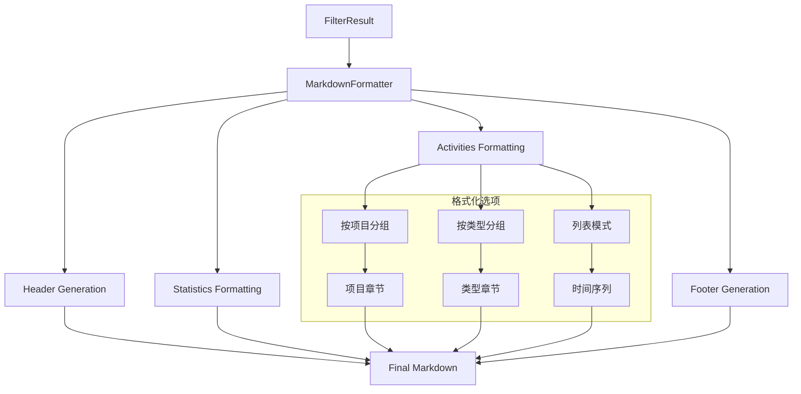
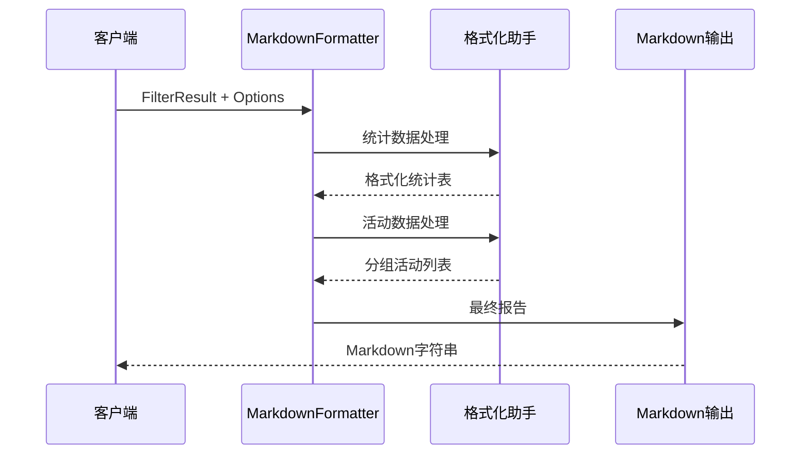

# 报告生成器模块

> **文件路径**: `src/utils/ReportGenerator.ts`  
> **模块类型**: 展示层/格式化工具  
> **依赖关系**: Date工具, GitLab类型, FilterResult

## 📋 模块概述

**ReportGenerator** 是项目的专业报告生成引擎，负责将分析后的GitLab活动数据转换为美观、结构化的Markdown报告。该模块采用了灵活的格式化架构，支持多种报告样式和自定义选项。

### 核心职责
- 📝 **Markdown生成**: 专业级Markdown报告格式化
- 📊 **数据可视化**: 统计图表和表格生成
- 🎨 **多样式支持**: 项目分组/类型分组/列表等多种布局
- 🔧 **高度可配置**: 丰富的格式化选项
- 🌐 **国际化**: 中文友好的格式化输出

## 🏗️ 技术架构

### 格式化流程图


### 数据处理架构


## 🔧 核心功能

### 1. 主格式化引擎 (Main Formatter)
```typescript
formatActivities(filterResult: FilterResult, timeRange: DateRange, options: FormatOptions = {}): string {
  const {
    showStatistics = true,
    groupByProject = true,
    groupByType = true,
    showMatchReasons = false,
    showDetailedTime = true,
    maxDescriptionLength = 200,
  } = options;

  const sections: string[] = [];
  
  // 1. 标题和时间范围
  sections.push(this.formatHeader(title, timeRange));
  
  // 2. 统计信息
  if (showStatistics) {
    sections.push(this.formatStatistics(statistics));
  }
  
  // 3. 活动详情 (支持多种分组方式)
  if (groupByProject) {
    sections.push(this.formatActivitiesByProject(activities));
  } else if (groupByType) {
    sections.push(this.formatActivitiesByType(activities));
  }
  
  return sections.join('\n\n');
}
```

### 2. 报告头部生成器
```typescript
private formatHeader(title: string, timeRange: DateRange, customDescription?: string): string {
  const timeDesc = customDescription || this.formatTimeRange(timeRange);
  
  return `# ${title}

**时间范围**: ${timeDesc}
**生成时间**: ${formatDate(new Date(), 'yyyy年MM月dd日 HH:mm:ss')}`;
}
```

**头部特性**:
- 动态标题支持
- 智能时间范围描述
- 自动生成时间戳
- 可自定义时间描述

### 3. 统计信息格式化
```typescript
private formatStatistics(statistics: FilterResult['statistics']): string {
  const sections = ['## 📊 统计信息'];
  
  sections.push(`**总计**: ${statistics.total} 个活动`);
  
  // 按类型分布
  if (Object.keys(statistics.byType).length > 0) {
    sections.push('### 📋 按类型分布');
    const typeItems = Object.entries(statistics.byType)
      .sort(([, a], [, b]) => b - a)
      .map(([type, count]) => `- **${this.getTypeDisplayName(type)}**: ${count} 个`);
    sections.push(typeItems.join('\n'));
  }
  
  return sections.join('\n\n');
}
```

## 📊 多样式布局支持

### 1. 按项目分组布局
```typescript
private formatActivitiesByProject(activities, matchReasons, options): string {
  const sections = ['## 📝 活动详情'];
  
  // 项目分组
  const byProject = this.groupByField(activities, 'projectName');
  
  for (const [projectName, projectActivities] of Object.entries(byProject)) {
    sections.push(`### 🏗️ ${projectName} (${projectActivities.length} 个活动)`);
    
    // 时间排序
    const sortedActivities = projectActivities.sort((a, b) => 
      b.createdAt.getTime() - a.createdAt.getTime()
    );
    
    // 渲染每个活动
    for (const activity of sortedActivities) {
      sections.push(this.formatSingleActivity(activity, matchReasons, options));
    }
  }
  
  return sections.join('\n\n');
}
```

### 2. 按类型分组布局
```typescript
private formatActivitiesByType(activities, matchReasons, options): string {
  const byType = this.groupByField(activities, 'type');
  
  for (const [type, typeActivities] of Object.entries(byType)) {
    sections.push(`### ${this.getTypeIcon(type)} ${this.getTypeDisplayName(type)} (${typeActivities.length} 个)`);
    // ... 类型相关格式化
  }
}
```

### 3. 单个活动格式化器
```typescript
private formatSingleActivity(activity, reasons, options): string {
  const { showMatchReasons, showDetailedTime, maxDescriptionLength } = options;
  const sections: string[] = [];

  // 标题行
  const typeIcon = this.getTypeIcon(activity.type);
  sections.push(`#### ${typeIcon} ${activity.title}`);

  // 基本信息行
  const info = [
    `**项目**: ${activity.projectName}`,
    `**类型**: ${this.getTypeDisplayName(activity.type)}`,
    `**作者**: ${activity.author}`,
    `**时间**: ${formatDate(activity.createdAt, 'yyyy年MM月dd日 HH:mm:ss')}`,
  ];
  sections.push(info.join(' | '));

  // 描述处理
  if (activity.description) {
    let description = activity.description.trim();
    if (description.length > maxDescriptionLength) {
      description = description.substring(0, maxDescriptionLength) + '...';
    }
    sections.push(`**描述**: ${description}`);
  }

  // 链接
  sections.push(`**链接**: [查看详情](${activity.webUrl})`);

  // 匹配原因 (可选)
  if (showMatchReasons && reasons.length > 0) {
    const reasonText = reasons.map((reason) => `- ${reason}`).join('\n');
    sections.push(`**匹配原因**:\n${reasonText}`);
  }

  return sections.join('\n\n');
}
```

## 🎨 视觉元素设计

### 1. 图标体系
```typescript
private getTypeIcon(type: string): string {
  const icons = {
    commit: '📝',
    issue: '🐛', 
    merge_request: '🔀',
    pipeline: '🚀',
  };
  return icons[type] || '📄';
}
```

### 2. 状态指示器
```typescript
private formatState(state: string): string {
  const stateMap = {
    opened: '🟢 打开',
    closed: '🔴 关闭', 
    merged: '🟣 已合并',
    success: '✅ 成功',
    failed: '❌ 失败',
    running: '🔄 运行中',
    pending: '⏳ 等待中',
    canceled: '⏹️ 已取消',
  };
  return stateMap[state] || state;
}
```

### 3. 中文类型映射
```typescript
private getTypeDisplayName(type: string): string {
  const names = {
    commit: '提交',
    issue: '问题', 
    merge_request: '合并请求',
    pipeline: '流水线',
  };
  return names[type] || type;
}
```

## ⚙️ 高级配置选项

### FormatOptions 接口
```typescript
export interface FormatOptions {
  showStatistics?: boolean;        // 显示统计信息
  groupByProject?: boolean;        // 按项目分组
  groupByType?: boolean;          // 按活动类型分组
  showMatchReasons?: boolean;     // 显示匹配原因
  showDetailedTime?: boolean;     // 显示详细时间
  maxDescriptionLength?: number;  // 限制描述长度
  title?: string;                // 自定义标题
  timeRangeDescription?: string; // 自定义时间描述
}
```

### 使用场景映射
| 场景 | 推荐配置 | 输出特点 |
|------|----------|----------|
| **管理汇报** | groupByProject=true, showDetailedTime=false | 按项目展示，时间简化 |
| **技术分析** | groupByType=true, showMatchReasons=true | 按类型分组，显示分类依据 |
| **调试诊断** | showMatchReasons=true, maxDescriptionLength=500 | 完整信息，便于调试 |
| **简洁预览** | showStatistics=false, maxDescriptionLength=100 | 精简信息 |

## 📅 时间处理

### 智能时间范围格式化
```typescript
private formatTimeRange(timeRange: DateRange): string {
  const { start, end } = timeRange;

  if (this.isSameDay(start, end)) {
    return formatDate(start, 'yyyy年MM月dd日 (E)');
  } else {
    return `${formatDate(start, 'yyyy年MM月dd日')} 至 ${formatDate(end, 'yyyy年MM月dd日')}`;
  }
}
```

**时间格式特性**:
- 同日期智能检测
- 中文友好格式
- 星期显示支持
- 跨日期范围展示

### 多种时间显示模式
```typescript
if (showDetailedTime) {
  info.push(`**创建时间**: ${formatDate(activity.createdAt, 'yyyy年MM月dd日 HH:mm:ss')}`);
  if (activity.updatedAt && activity.updatedAt.getTime() !== activity.createdAt.getTime()) {
    info.push(`**更新时间**: ${formatDate(activity.updatedAt, 'yyyy年MM月dd日 HH:mm:ss')}`);
  }
} else {
  info.push(`**时间**: ${formatDate(activity.createdAt, 'MM月dd日 HH:mm')}`);
}
```

## 🔧 工具函数

### 1. 数据分组器
```typescript
private groupByField<T extends Record<string, any>>(items: T[], field: keyof T): Record<string, T[]> {
  return items.reduce((groups, item) => {
    const key = String(item[field]);
    if (!groups[key]) {
      groups[key] = [];
    }
    groups[key].push(item);
    return groups;
  }, {} as Record<string, T[]>);
}
```

### 2. 摘要生成器
```typescript
generateSummary(filterResult: FilterResult, timeRange: DateRange): string {
  const { activities, statistics } = filterResult;
  
  if (activities.length === 0) {
    return `在${this.formatTimeRange(timeRange)}期间没有找到匹配的活动。`;
  }
  
  const parts: string[] = [];
  parts.push(`在${this.formatTimeRange(timeRange)}期间`);
  parts.push(`共有 ${statistics.total} 个活动`);
  
  // 主要活动类型
  const topTypes = Object.entries(statistics.byType)
    .sort(([, a], [, b]) => b - a)
    .slice(0, 2)
    .map(([type, count]) => `${count}个${this.getTypeDisplayName(type)}`);
    
  if (topTypes.length > 0) {
    parts.push(`包括 ${topTypes.join('、')}`);
  }
  
  return parts.join('，') + '。';
}
```

## 📋 输出示例

### 典型报告结构
```markdown
# GitLab 活动报告

**时间范围**: 2025年01月01日 至 2025年01月31日
**生成时间**: 2025年01月17日 15:30:45

## 📊 统计信息

**总计**: 45 个活动

### 📋 按类型分布
- **新功能**: 12 个
- **Bug修复**: 18 个  
- **改进优化**: 10 个
- **其他**: 5 个

### 🏗️ 按项目分布
- **awesome-project**: 23 个
- **helper-tools**: 12 个
- **documentation**: 10 个

## 📝 活动详情

### 🏗️ awesome-project (23 个活动)

#### 📝 feat: 添加用户认证系统

**项目**: awesome-project | **类型**: 新功能 | **作者**: 张三 | **时间**: 2025年01月15日 14:30:22

**描述**: 实现基于JWT的用户认证系统，支持登录、注册、密码重置等功能

**链接**: [查看详情](https://gitlab.com/project/commits/abc123)

---

*本报告由 GitLab Activity MCP 自动生成*
```

## 🔍 使用示例

```typescript
// 1. 基础用法
const markdown = formatActivitiesMarkdown(filterResult, timeRange);

// 2. 自定义选项
const customMarkdown = formatActivitiesMarkdown(filterResult, timeRange, {
  title: '月度工作总结',
  groupByProject: true,
  showMatchReasons: false,
  maxDescriptionLength: 150,
});

// 3. 生成摘要
const summary = generateActivitySummary(filterResult, timeRange);

// 4. 调试模式
const debugMarkdown = formatActivitiesMarkdown(filterResult, timeRange, {
  showMatchReasons: true,
  showDetailedTime: true,
  maxDescriptionLength: 500,
});
```

---

*📅 最后更新: 2025年1月17日 | 📝 输出格式: Professional Markdown*


